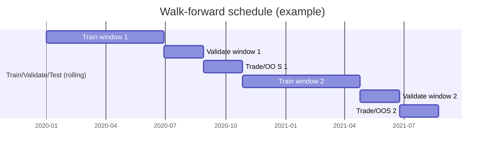
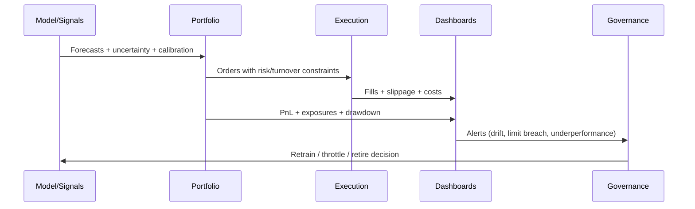

# Fixing Overfitting and Designing a Robust Multi-Strategy Quant Fund

## Executive summary

Overfitting in systematic trading is rarely “one bug” and almost always a *stack* of issues: (a) information leakage (direct or indirect), (b) selection bias from repeated backtests / hyperparameter search, (c) non-stationarity and regime shifts, and (d) under-modeled implementation costs (turnover, slippage, market impact). Foundational research shows why “great backtests” can fail out-of-sample (OOS) even after a conventional hold-out split, because the discovery process itself induces selection bias and backtest overfitting risk. citeturn17view0turn17view1turn6search0turn6search1turn6search18

A practical, multi-strategy fund should therefore treat “overfitting mitigation” as a *layered defense system*:

1) **Causality & leakage prevention first** (time-correct pipelines, purging/embargo, strict feature generation rules). If your environment hands your strategy the *entire* price matrix, you must enforce “no future prices used for earlier decisions,” including via derived features, or you effectively disqualify your results in any serious validation regime. fileciteturn0file0 citeturn10search6turn10search2turn6search3  
2) **Validation that matches financial labels**: prefer purged / embargoed schemes and multi-path evaluation (e.g., CPCV-like ideas), and quantify the probability your result is a selection artifact (PBO/DSR-type thinking). citeturn17view0turn17view1turn11view0turn10search12  
3) **Model-level controls** (regularization, early stopping, ensembling, uncertainty & calibration, feature selection, and explicit complexity limits). citeturn18view0turn18view1turn17view3turn10search11turn1search7turn8search3turn1search2turn8search0turn8search1  
4) **Strategy diversification + risk budgeting**: combine structurally different alpha sources (factor premia, market-neutral stat arb, volatility risk premia, event-driven spreads, microstructure/short-horizon edges) and allocate by risk, not backtest Sharpe. citeturn3search2turn4search2turn25view0turn25view2turn25view3turn5search9turn23search11turn24search0  
5) **Governance & monitoring**: implement model risk limits, independent validation, and drift/performance monitoring, consistent with established model-risk thinking (even if you’re not a bank). citeturn14search0turn14search1turn14search14

The remainder of this report gives a method-by-method and strategy-by-strategy catalog (with pros/cons, implementation steps, data needs, compute, hyperparameters, metrics, and failure modes), then proposes concrete hybrid multi-sleeve fund designs with portfolio construction, risk allocation, rebalancing cadence, and a rigorous backtesting protocol.

## Why trading systems overfit and how to diagnose it

Financial prediction differs from many ML benchmarks: signal-to-noise is low; data is autocorrelated, non-stationary, and subject to regime shifts; and “labels” often overlap horizons (e.g., event-based returns), which can silently leak information across folds if you use naive cross-validation. citeturn11view0turn6search3turn10search12turn17view0

### Core failure modes behind “good backtests”
**Selection bias and multiple testing**: Reusing the same data for repeated idea search (“try 1,000 variants and pick the best”) creates data-snooping risk; classic work formalizes this issue and proposes “reality check” style corrections. citeturn6search0turn6search1turn17view1turn17view0  
**Backtest overfitting probability**: Work on PBO frames the risk that the in-sample (IS) “winner” is actually a loser OOS, and argues for cross-validation designs that estimate this probability rather than reporting a single Sharpe. citeturn17view0turn17view2  
**Implementation blind spots**: Even academically documented strategies can be sensitive to transaction costs and market microstructure; stat arb performance in publication is often conditional on cost assumptions and time period. citeturn25view0turn25view1turn24search7turn24search2  
**Non-stationarity / regime shifts**: Empirical studies emphasize that performance can vary sharply through time (e.g., stat arb strengths changing pre/post certain eras). citeturn25view0turn11view0

### Diagnostic checklist (practical)
A recurring pattern: “IS Sharpe is high, OOS is mediocre, and live is negative.” That can reflect leakage, selection bias, or cost/model drift. The following symptoms help narrow the root cause: citeturn10search6turn17view0turn24search2turn11view0

| Symptom | Likely cause | High-leverage fix |
|---|---|---|
| Huge gap between IS and OOS | leakage; multiple testing; regime shift | time-safe pipeline + purging/embargo; PBO/DSR; regime-split tests citeturn10search6turn17view0turn17view1turn11view0 |
| Performance driven by a few periods | overfit to one regime | walk-forward + regime-conditioned evaluation; dynamic risk scaling citeturn11view0turn25view0 |
| Very high turnover, great gross Sharpe | ignored costs | explicit impact/slippage model + execution constraints citeturn24search7turn24search2turn0search6 |
| Stable predictions but unstable PnL | poor calibration; misspecified costs | calibration + decision thresholds; cost-aware objective citeturn1search2turn24search7 |
| Parameter instability (sign flips, huge weights) | ill-conditioned estimation | shrinkage / ridge / robust estimators citeturn8search0turn24search0turn24search5 |

## Model-level ML regularization and robustness methods

This section covers the model-level techniques you listed. For each method, I provide: description; pros/cons; implementation steps; required data; compute cost; typical hyperparameters; evaluation metrics; failure modes.

### Comparison table for ML regularization methods

Interpret “effectiveness” as reducing the IS→OOS gap *when leakage is already controlled*, and “robustness” as stability across regimes and hyperparameter sensitivity. citeturn17view0turn11view0turn18view1turn1search7

| Method | Effectiveness | Cost | Data needs | Robustness |
|---|---:|---:|---:|---:|
| Dropout | Med | Low | Med | Med |
| Weight decay (L2 / AdamW) | High | Low | Med | High |
| Early stopping | Med | Low | Med | Med |
| Ensembling (bagging / deep ensembles) | High | High | High | High |
| Bayesian approx (MC-dropout) | Med | Med | Med | Med |
| Calibration (temperature scaling, reliability) | Med | Low | Low | High |
| Data augmentation (mixup-style) | Med | Med | High | Med |
| Feature selection (LASSO/elastic net/Boruta) | High | Med | Med | High |
| CV variants (nested + time-safe) | High | High | High | High |
| Transfer learning | Med | High | High | Med |
| Meta-learning | Potentially High | Very High | Very High | Uncertain/fragile |

### Dropout
**Description:** Randomly drop units during training to reduce co-adaptation; can be interpreted as training an implicit ensemble of “thinned” networks. citeturn18view0turn8search3  
**Pros/cons:** Pros—easy to add; often improves generalization; can yield uncertainty via MC-dropout. Cons—can underfit in low-signal finance; interacts with batch norm and sequence models. citeturn18view0turn8search3turn11view0  
**Implementation steps:** (1) Add dropout layers (or attention dropout) in the model; (2) tune dropout rate on *time-safe* validation; (3) optionally use MC-dropout at inference to estimate predictive dispersion. citeturn18view0turn8search3turn6search3  
**Required data:** Whatever your base model uses (returns/features), plus a validation split that respects time. citeturn6search3turn11view0  
**Compute cost:** Low to moderate; inference cost increases if using MC samples. citeturn8search3turn18view0  
**Typical hyperparameters:** dropout p ∈ [0.05, 0.5]; MC samples S ∈ [20, 200] for uncertainty. citeturn18view0turn8search3  
**Evaluation metrics:** predictive loss (MSE/MAE), log loss; trading metrics (net Sharpe, turnover-adjusted Sharpe), calibration error if using probabilities. citeturn1search2turn15search3turn17view1  
**Failure modes:** “Looks robust” but still overfits via feature/label leakage; dropout increases variance in small datasets; MC-dropout uncertainty can be miscalibrated under drift. citeturn10search6turn8search3turn11view0

### Weight decay / L2 regularization and AdamW
**Description:** Penalize large weights to reduce effective model complexity; for adaptive optimizers, decoupled weight decay (AdamW) corrects the mismatch between “L2 regularization” and true weight decay. citeturn18view1turn8search1turn8search0  
**Pros/cons:** Pros—high ROI; improves stability; combats multicollinearity and noisy features. Cons—too strong decay can kill signal; requires careful validation aligned to time. citeturn18view1turn11view0  
**Implementation steps:** (1) Use AdamW-style decoupled decay when using adaptive optimizers; (2) tune λ jointly with learning rate schedule; (3) consider “shrinkage everywhere”: ridge/elastic-net in linear baselines too. citeturn18view1turn8search1turn24search0turn8search0  
**Required data:** Same as baseline. citeturn18view1  
**Compute cost:** Low. citeturn18view1  
**Typical hyperparameters:** weight decay λ ∈ [1e-6, 1e-2] (model-dependent); for ridge, α ∈ [1e-4, 1e3]. citeturn18view1turn8search1  
**Evaluation metrics:** OOS loss; parameter stability (norms, sign stability); net Sharpe after costs. citeturn17view1turn24search7  
**Failure modes:** “Regularization as placebo” if leakage dominates; non-stationarity makes the best λ regime-dependent. citeturn10search6turn11view0

### Early stopping
**Description:** Stop training when validation performance stops improving; reduces overfitting by preventing memorization beyond the generalization optimum. citeturn17view3  
**Pros/cons:** Pros—simple; acts like implicit capacity control; can cut training time. Cons—needs a reliable validation set; with non-stationarity, the validation regime may not match future regimes. citeturn17view3turn11view0  
**Implementation steps:** (1) Define time-safe validation sets; (2) monitor validation loss or trading proxy; (3) stop with patience + min_delta; save best checkpoint. citeturn17view3turn6search3  
**Required data:** Separate validation period that is not contaminated by overlapping labels. citeturn10search12turn6search3  
**Compute cost:** Low; often reduces cost. citeturn17view3  
**Typical hyperparameters:** patience 5–50 epochs; min_delta ~1e-4–1e-2; smoothing window for noisy validation. citeturn17view3  
**Evaluation metrics:** validation NLL/MSE; stability of OOS Sharpe across folds. citeturn17view0turn17view3  
**Failure modes:** stopping on a noisy metric; overfitting the validation set by repeated early-stopping tuning (a form of multiple testing). citeturn17view1turn6search0turn17view3

### Ensembling
**Description:** Combine multiple models to reduce variance; includes bagging (bootstrap aggregating) and deep ensembles trained with different seeds/splits. citeturn10search11turn1search7turn18view3  
**Pros/cons:** Pros—among the most reliable variance-reduction tools; improves uncertainty estimation in practice. Cons—expensive; risk of “ensemble of overfit models” if leakage persists; operational complexity. citeturn10search11turn18view3turn10search6  
**Implementation steps:** (1) Pick ensemble diversity source: bootstrap samples, different seeds, or different model classes; (2) train members on time-safe splits; (3) average forecasts *or* average positions with risk limits. citeturn10search11turn1search7turn6search3  
**Required data:** More data helps; ensembles are more effective when members see meaningfully different training samples. citeturn10search11turn11view0  
**Compute cost:** High (≈K× training). citeturn18view3turn10search11  
**Typical hyperparameters:** ensemble size K ∈ [5, 50]; bootstrap block length for time series bagging; member diversity constraints. citeturn10search11turn5search3  
**Evaluation metrics:** OOS mean and dispersion of metrics (Sharpe distribution across members); calibration of ensemble probabilities. citeturn18view3turn1search2turn17view0  
**Failure modes:** ensembles hide structural breaks (smooths but doesn’t fix); correlated errors across models during regime shifts reduces benefit. citeturn11view0turn18view3

### Bayesian methods and uncertainty-aware modeling
**Description:** Learn distributions over parameters or predictions to represent uncertainty; approximate Bayesian inference can be achieved via dropout variants (MC-dropout) for deep nets. citeturn8search3turn8search7turn1search7  
**Pros/cons:** Pros—helps position sizing and gating; improves robustness under distribution shift when uncertainty is informative. Cons—approximate methods can be miscalibrated; computational overhead; model misspecification risk. citeturn8search3turn18view3turn11view0  
**Implementation steps:** (1) Choose uncertainty target: epistemic vs aleatoric; (2) implement MC-dropout or Bayesian last-layer; (3) incorporate uncertainty into trading via confidence thresholds or risk-scaling. citeturn8search3turn1search7turn1search2  
**Required data:** Same features/labels; benefits from diverse regimes. citeturn11view0turn8search3  
**Compute cost:** Medium to high (multiple forward passes or more complex inference). citeturn8search3turn18view3  
**Typical hyperparameters:** prior scale; dropout p and MC samples; uncertainty penalties. citeturn8search3turn8search7  
**Evaluation metrics:** proper scoring rules (NLL, Brier), coverage of prediction intervals, calibration plots. citeturn1search2turn15search3turn15search2  
**Failure modes:** uncertainty is “confidently wrong” in unseen regimes; uncertainty estimates degrade if feature pipeline drifts. citeturn11view0turn14search14

### Calibration
**Description:** Ensure predicted probabilities match realized frequencies; temperature scaling is a simple post-hoc calibrator that often works well. citeturn1search2turn18view2  
**Pros/cons:** Pros—high value for threshold-based trading (only trade when p>τ); cheap; improves risk controls. Cons—requires a clean validation set; can overfit if you use complex calibrators on small data. citeturn18view2turn1search2turn11view0  
**Implementation steps:** (1) Train model; (2) fit calibrator on *held-out* validation set; (3) monitor calibration drift in production. citeturn1search2turn18view2turn14search14  
**Required data:** Probabilistic labels (classification or quantile forecasts); enough validation samples. citeturn1search2turn15search3  
**Compute cost:** Low. citeturn1search2  
**Typical hyperparameters:** temperature T (single parameter); bin count for reliability diagrams; recalibration cadence. citeturn1search2turn18view2  
**Evaluation metrics:** ECE/reliability diagram; NLL; Brier score; calibration slope/intercept. citeturn1search2turn15search3  
**Failure modes:** calibration set leakage; recalibration over-trading in non-stationary regimes. citeturn10search6turn11view0

### Data augmentation (including mixup-style)
**Description:** Create synthetic training examples to reduce sensitivity to noise; mixup trains on convex combinations of pairs of examples and labels, acting as a regularizer. citeturn2search11turn2search7  
**Pros/cons:** Pros—improves smoothness; can reduce memorization; often boosts robustness. Cons—financial datasets have structure (time order, constraints) that naive augmentation can break; risk of “synthetic leakage” if augmented across time boundaries. citeturn2search11turn11view0turn6search3  
**Implementation steps:** (1) Define augmentation that preserves causality and label meaning; (2) ensure augmentations never cross train/test temporal boundary; (3) ablate augmentation strength. citeturn2search11turn6search3turn10search6  
**Required data:** More data helps; for time series, augmentations should respect autocorrelation. citeturn5search3turn11view0  
**Compute cost:** Medium (more training, more samples). citeturn2search11  
**Typical hyperparameters:** mixup α (Beta distribution concentration); noise scale; block length for block-bootstrapped sequences. citeturn2search11turn5search3  
**Evaluation metrics:** OOS loss; robustness to label noise; stability across time splits. citeturn2search3turn6search3  
**Failure modes:** augmentation creates unrealistic states → “paper alpha”; augmentation increases variance if mis-specified. citeturn11view0turn9search0

### Feature selection
**Description:** Reduce dimensionality and control substitution effects; LASSO induces sparsity via an L1 penalty; elastic net blends L1 and L2 to handle correlated predictors. citeturn8search0turn8search1  
**Pros/cons:** Pros—often the best control for tabular finance; improves interpretability and stability; reduces variance. Cons—can discard weak-but-real signals; unstable feature sets under regime shifts unless constrained. citeturn8search0turn8search1turn11view0  
**Implementation steps:** (1) Start with simple linear baseline + elastic net; (2) perform nested, time-safe CV to choose λ and mixing ratio; (3) lock a feature set per retraining epoch to limit churn. citeturn8search1turn6search3turn17view0  
**Required data:** Tabular predictors (prices, fundamentals, alt data); enough samples relative to features. citeturn3search0turn8search1  
**Compute cost:** Medium; solving sparse models is cheap compared with deep nets. citeturn8search1turn8search0  
**Typical hyperparameters:** LASSO λ; elastic net α_mix; stability-selection thresholds; forced inclusion/exclusion constraints. citeturn8search1turn8search0  
**Evaluation metrics:** OOS R² / IC, stability of selected features, net Sharpe after costs. citeturn3search0turn17view1  
**Failure modes:** feature leakage via normalization fit on full data; multiple testing via repeated feature searches. citeturn10search6turn6search0turn17view1

### Cross-validation variants (nested, time-series, purged/embargo, CPCV-style)
**Description:** In finance, naive K-fold violates temporal structure; time-series CV provides monotone splits; purging/embargo aims to avoid leakage when labels overlap; recent work argues multi-path CV (CPCV-like) can reduce false discoveries relative to simple walk-forward. citeturn6search3turn10search12turn11view0turn17view0  
**Pros/cons:** Pros—high impact; turns model selection into statistical estimation; produces distributions of performance vs a single point estimate. Cons—computationally heavy; easy to implement incorrectly; still vulnerable if your feature pipeline leaks. citeturn11view0turn10search6turn17view0  
**Implementation steps:** (1) Use nested CV: inner loop for hyperparameters, outer loop for reporting; (2) optionally add purging/embargo logic around label horizons; (3) summarize as distribution (median, tails) not just mean Sharpe. citeturn6search3turn17view0turn11view0turn10search12  
**Required data:** timestamped data + label horizon metadata. citeturn10search12turn6search3  
**Compute cost:** High (many fits). citeturn11view0turn17view0  
**Typical hyperparameters:** number of splits; embargo fraction; fold lengths; retraining frequency. citeturn6search3turn10search12turn11view0  
**Evaluation metrics:** PBO-like measures; DSR-like corrections; fold-level stability. citeturn17view0turn17view1turn11view0  
**Failure modes:** leakage by feature engineering across folds; “hyperparameter overfitting” via repeated CV runs. citeturn10search6turn17view1turn6search0

### Transfer learning
**Description:** Pretrain on large source tasks/domains and fine-tune on the target; surveys map transfer learning mechanisms and transferability issues in deep learning practice. citeturn9search15turn9search7  
**Pros/cons:** Pros—useful when your target alpha task has limited labels (e.g., sparse events); can improve representation learning. Cons—domain shift is severe in finance; negative transfer is common; operational complexity. citeturn9search15turn11view0  
**Implementation steps:** (1) Define a “broad pretrain” task (e.g., multi-asset return reconstruction, volatility forecasting, text embedding); (2) fine-tune last layers on your target; (3) freeze vs unfreeze schedules and monitor drift. citeturn9search15turn14search14  
**Required data:** Large pretraining dataset (cross-asset, long history, or alternative data). citeturn3search0turn9search15  
**Compute cost:** High. citeturn9search15  
**Typical hyperparameters:** freeze depth; learning rate multipliers; fine-tune epochs; domain-adaptation regularizers. citeturn9search15  
**Evaluation metrics:** OOS uplift vs (a) training from scratch and (b) linear baselines; stability across time splits. citeturn9search15turn6search3  
**Failure modes:** negative transfer; leakage via pretrained embeddings trained on future info relative to your test period. citeturn10search6turn11view0

### Meta-learning
**Description:** Learn parameters that adapt quickly to new tasks; MAML is a canonical method that trains models to be easy to fine-tune with few gradient steps. citeturn9search2turn9search14  
**Pros/cons:** Pros—conceptually fits “regime as task” (adapt to new market regimes); can shorten retraining latency. Cons—very compute/data-hungry; unstable; success depends on having many diverse “tasks” that resemble future regimes. citeturn9search2turn11view0  
**Implementation steps:** (1) Define tasks (e.g., rolling regimes by volatility/market state, or asset clusters); (2) run meta-training; (3) constrain adaptation to avoid chasing noise; integrate risk limits. citeturn9search2turn14search0  
**Required data:** Many tasks, each with enough samples; robust task design. citeturn9search2turn11view0  
**Compute cost:** Very high (inner-loop optimization per task). citeturn9search2  
**Typical hyperparameters:** inner steps; inner LR; meta LR; task batch size; regularization on adaptation magnitude. citeturn9search2  
**Evaluation metrics:** adaptation benefit measured on *future* tasks; distribution of outcomes across task splits. citeturn9search2turn17view0  
**Failure modes:** “meta-overfitting” (learn to exploit quirks of task construction); fragile under real regime breaks. citeturn11view0turn6search0

## Training and data-level methods, time-series validation, and leakage prevention

### Resampling methods (block bootstrap / stationary bootstrap)
**Description:** Resample dependent time-series blocks to approximate sampling distributions and create varied training scenarios; the stationary bootstrap is designed for dependent sequences. citeturn5search3turn5search7  
**Pros/cons:** Pros—helps estimate uncertainty of metrics; useful for bagging/time-series augmentation; supports stress-testing. Cons—block length selection matters; can destroy microstructure if misapplied; does not fix structural breaks. citeturn5search3turn11view0  
**Implementation steps:** (1) Choose bootstrap scheme (moving block vs stationary); (2) tune block length to match dependence; (3) evaluate performance distribution and parameter stability across resamples. citeturn5search3turn17view0  
**Required data:** Time series at the strategy frequency. citeturn5search3  
**Compute cost:** Medium to high (many resamples). citeturn5search3turn10search11  
**Typical hyperparameters:** expected block length; number of resamples B (e.g., 100–1000). citeturn5search3  
**Evaluation metrics:** distribution of Sharpe / drawdown; stability of feature importances and exposures. citeturn17view0turn15search0  
**Failure modes:** resampling across regimes masks regime shift; “bootstrap optimism” if resamples are too similar to the original. citeturn11view0turn17view0

### Synthetic data generation (GANs and diffusion for time series)
**Description:** Time-series GANs (e.g., TimeGAN) and diffusion models can generate realistic sequences; newer diffusion approaches (e.g., TSDiff / time-series diffusion variants) broaden the toolkit for generation, refinement, and forecasting-related syntheses. citeturn9search0turn9search1turn9search17turn9search13  
**Pros/cons:** Pros—augment rare events; privacy-preserving sharing; scenario generation for stress; can improve representation learning. Cons—high risk of learning spurious dynamics; synthetic data can leak test regime structure if trained improperly; evaluation is hard. citeturn9search0turn9search1turn11view0  
**Implementation steps:** (1) Train generator strictly on the training period; (2) validate synthetic fidelity (marginals, autocorrelation, tail behavior) *and* “usefulness” for downstream prediction; (3) ablate synthetic proportion and check OOS uplift. citeturn9search0turn9search1turn17view0  
**Required data:** Long-enough histories; feature-rich sequences. citeturn9search0turn9search1  
**Compute cost:** High (deep generative training). citeturn9search0turn9search1  
**Typical hyperparameters:** latent dimensionality; adversarial loss weights (GANs); diffusion steps / noise schedule (diffusion). citeturn9search0turn9search1turn9search17  
**Evaluation metrics:** distributional similarity tests; downstream predictive uplift; stress-scenario replay; tail-fit diagnostics. citeturn9search0turn9search1turn11view0  
**Failure modes:** generator memorizes training set (privacy/data leakage risk); synthetic data improves IS but worsens OOS due to “model closure” illusions. citeturn6search0turn11view0

### Adversarial training
**Description:** Train on worst-case perturbed inputs to improve robustness; foundational work shows adversarial examples and adversarial training can reduce error in certain settings. citeturn2search6turn2search2  
**Pros/cons:** Pros—improves stability to small feature perturbations and some distribution shifts; can reduce “brittle” decision boundaries. Cons—may reduce raw accuracy; financial perturbations must be domain-valid (no “future-peeking” perturbations). citeturn2search6turn11view0  
**Implementation steps:** (1) Define perturbations consistent with your feature space (e.g., bounded noise on standardized features); (2) generate adversarial samples during training; (3) evaluate robustness under stress tests and drift scenarios. citeturn2search6turn14search14  
**Required data:** Same as model; plus robustness stress harness. citeturn2search6  
**Compute cost:** Medium to high. citeturn2search6  
**Typical hyperparameters:** perturbation budget ε; adversarial step count; robust loss weight. citeturn2search6  
**Evaluation metrics:** robust accuracy/loss; worst-case drawdown under feature shocks; stability of turnover. citeturn2search6turn16search6  
**Failure modes:** adversarial samples are unrealistic; robust training focuses on the wrong invariances for finance. citeturn11view0turn14search14

### Time-series CV and walk-forward
**Description:** TimeSeriesSplit-style CV avoids training on future and testing on past by using ordered splits; walk-forward trains on past windows and tests on later windows sequentially. citeturn6search3turn10search12turn11view0  
**Pros/cons:** Pros—matches temporal reality; easy to explain. Cons—single-path walk-forward can have high variance (performance depends on one historical path) and may be weaker at preventing false discoveries than multi-path schemes in some analyses. citeturn11view0turn17view0turn6search3  
**Implementation steps:** (1) Define retrain schedule; (2) ensure all preprocessing is fit on train only (pipeline); (3) record per-window performance distribution, not just cumulative. citeturn6search3turn10search2turn10search6  
**Required data:** Chronological time series. citeturn6search3  
**Compute cost:** Medium (repeated training). citeturn6search3turn11view0  
**Typical hyperparameters:** train window length; test (hold) length; step size; expanding vs rolling window. citeturn6search3turn11view0  
**Evaluation metrics:** rolling Sharpe; drawdown per window; turnover and costs per window. citeturn16search6turn24search7  
**Failure modes:** accidental leakage through feature engineering; “window hunting” (choosing the best window size via repeated search). citeturn10search6turn6search0turn17view1

### Leakage prevention (hard rules and pipeline structure)
**Description:** Leakage is any inclusion of test information in training or decision-making; even standard preprocessing can leak if fit on full data, so pipelines must fit transforms on training only and apply to test. citeturn10search6turn10search2  
**A critical trading-specific rule:** If your strategy function receives the full price matrix, you must not use any price at time *t* when deciding any action for an earlier time; also avoid derived featurization that implicitly uses future elements. fileciteturn0file0  
**Pros/cons:** Pros—highest ROI; prevents fake alpha. Cons—requires discipline and tooling; easy to violate in subtle ways (label construction, normalization, rolling stats with wrong alignment). citeturn10search6turn17view0  
**Implementation steps:** (1) Enforce “as-of time” data access via a feature store keyed by timestamp; (2) unit test no-lookahead (shift tests, backfill checks); (3) block access to full arrays in modeling code unless guarded by strict indexing APIs. citeturn10search6turn14search14  
**Required data:** Timestamped feeds; metadata for event times and publication times (for fundamentals/news). citeturn14search14turn11view0  
**Compute cost:** Low to medium (engineering-heavy more than compute). citeturn14search14turn10search6  
**Typical hyperparameters:** Not applicable; instead use “policy parameters” like allowed lookback windows, embargo length, and as-of delays. citeturn10search12turn11view0  
**Evaluation metrics:** leakage tests (AUC on shifted labels should collapse); OOS degradation vs IS; stability under time-shuffled “negative controls.” citeturn10search6turn17view0  
**Failure modes:** survivorship bias, look-ahead via corporate actions, event timestamp errors, or “future label overlap” across folds. citeturn10search12turn11view0turn17view0

### Comparison table for validation schemes

| Scheme | Prevents temporal inversion | Handles overlapping labels | Produces distribution of outcomes | Typical cost |
|---|---:|---:|---:|---:|
| Simple hold-out | Yes | Often no | No | Low |
| TimeSeriesSplit | Yes | Partially | Limited | Med citeturn6search3 |
| Walk-forward | Yes | Partially | Limited | Med citeturn10search12turn11view0 |
| Purging/embargo concepts | Yes | Yes (in principle) | Depends | High citeturn10search12turn11view0 |
| CPCV-style multi-path | Yes | Yes (in principle) | Yes | High–Very High citeturn11view0turn17view0turn10search12 |

## Monitoring, backtest hygiene, transaction costs, and governance

This section maps “overfitting fixes” to the operational lifecycle: research → validation → deployment → monitoring → retirement.

### Backtest hygiene and statistical defensibility
**Description:** Backtests are vulnerable to “researcher degrees of freedom.” Classic work defines data snooping and provides procedures to guard against it; other work formalizes PBO and argues that reporting backtests without controlling for selection bias can be misleading. citeturn6search0turn17view0turn17view1  
**Pros/cons:** Pros—turns a backtest into an inference exercise; reduces false discoveries. Cons—more conservative; can feel “too strict,” but that’s the point. citeturn6search0turn6search1turn17view1  
**Implementation steps:** (1) Pre-register the experiment plan internally (what you will try, max tries); (2) compute multiple-testing-aware statistics or use reality-check/SPA-style tests when comparing many strategies; (3) track “research trials count” and use deflated metrics. citeturn6search0turn6search1turn17view1turn6search18  
**Required data:** Backtest returns; catalog of trials; assumptions. citeturn17view1turn6search0  
**Compute cost:** Medium (mostly resampling/cross-validation). citeturn17view0turn6search0  
**Typical hyperparameters:** bootstrap replications; confidence levels; benchmark strategy set. citeturn6search0turn17view0  
**Evaluation metrics:** PBO distribution; deflated Sharpe-style thinking; worst-decile outcomes across folds; drawdown tails. citeturn17view0turn17view1turn16search6  
**Failure modes:** treating adjusted metrics as “license to overfit”; failing to include transaction costs/market impact in every trial. citeturn17view1turn24search7

### Transaction costs, slippage, and market impact
**Description:** Execution and market impact are central; foundational work models optimal execution as a trade-off between impact and timing risk; empirical work estimates market impact and provides frameworks for cost modeling and best execution. citeturn24search7turn0search2turn0search6turn24search2  
**Pros/cons:** Pros—prevents “phantom Sharpe”; improves capacity estimates; aligns research with reality. Cons—impact models are noisy; costs are regime-dependent; overfitting can shift from alpha model to cost model. citeturn0search2turn24search2turn11view0  
**Implementation steps:** (1) Build a cost model: fees + spread + slippage + impact; (2) implement conservative assumptions and sensitivity (best/base/worst); (3) enforce turnover and participation constraints in portfolio construction. citeturn24search7turn24search2turn0search6  
**Required data:** Trades, quotes, spreads, volume/liquidity; for intraday, order book data. citeturn5search9turn24search2turn0search2  
**Compute cost:** Medium to high (depending on microstructure simulation fidelity). citeturn0search2turn5search9  
**Typical hyperparameters:** impact curve parameters; spread assumptions; latency/slippage distributions; max participation %. citeturn0search2turn24search7  
**Evaluation metrics:** net Sharpe, net IR; turnover; implementation shortfall; realized vs predicted slippage error. citeturn24search7turn0search6turn16search0  
**Failure modes:** ignoring market stress (impact spikes); assuming infinite liquidity; backtest that trades at mid/close without realistic fill logic. citeturn24search7turn11view0

### Model risk limits, governance, and explainability
**Description:** Model risk management frameworks emphasize robust development, validation, and governance; guidance such as SR 11-7 (and parallel OCC guidance) describes expectations for model development, validation, and controls. citeturn14search0turn14search1  
**Pros/cons:** Pros—prevents “rogue model” failures; improves operational resilience; supports scaling a multi-strategy platform. Cons—adds process overhead; requires independent validation resources. citeturn14search0turn14search1turn14search14  
**Implementation steps:** (1) Define model inventory (every alpha + allocator + cost model); (2) independent validation with documented limitations and tests; (3) set risk limits (max leverage, max exposure by factor, max drawdown triggers) and governance approvals for changes. citeturn14search0turn14search1turn14search14  
**Explainability tooling:** Use feature attribution methods such as SHAP; for deep models, integrated gradients can satisfy axiomatic properties and aid debugging. citeturn15search0turn15search5  
**Required data:** Model inputs/outputs; metadata for monitoring and audit; validation datasets. citeturn14search14turn14search0  
**Compute cost:** Medium (monitoring + explainability). citeturn15search0turn14search14  
**Typical hyperparameters:** risk limits (gross/net exposure caps, VaR/ES limits); drift thresholds; explanation sampling sizes. citeturn14search14turn15search0  
**Evaluation metrics:** limit breaches; stability of feature attributions; incident rates; post-change performance vs expectation bands. citeturn14search14turn15search0  
**Failure modes:** “explainability theater” (pretty plots, no decisions); governance that lags reality; monitoring that ignores regime shifts until losses occur. citeturn11view0turn14search14

### Mermaid diagram for the research-to-production control flow

```mermaid
flowchart LR
  A[Raw data feeds] --> B[As-of-time feature store]
  B --> C[Research pipeline]
  C --> D[Time-safe validation<br/>+ purging/embargo logic]
  D --> E[Backtest hygiene layer<br/>PBO/selection-bias checks]
  E --> F[Portfolio construction<br/>risk budgets + constraints]
  F --> G[Execution simulator<br/>cost + impact model]
  G --> H[Paper trading / shadow]
  H --> I[Production trading]

  I --> J[Monitoring dashboards<br/>PnL, risk, drift, costs]
  J --> K[Governance actions<br/>retrain, de-risk, retire]
  K --> C
```

## Strategy-level diversification: alpha sleeves and arbitrage strategies

Below are strategy modules you can combine in a multi-strategy fund. Each includes description; pros/cons; steps; data; compute; hyperparameters; metrics; failure modes.

### Statistical arbitrage (market-neutral residual mean reversion)
**Description:** Build a market-neutral portfolio by modeling idiosyncratic returns (e.g., residuals from PCA or ETF factor regression) as mean reverting, generating contrarian signals. citeturn25view0  
**Pros/cons:** Pros—structurally market-neutral; can diversify factor sleeves. Cons—performance varies across eras; sensitive to costs; crowdedness risk. citeturn25view0turn24search7  
**Implementation steps:** (1) Estimate common components (PCA or factor regression) on a rolling basis; (2) compute residuals and mean-reversion signals; (3) construct dollar-neutral portfolio with risk constraints and cost-aware trading. citeturn25view0turn24search7turn10search6  
**Required data:** Price returns; optional sector ETFs or factor returns. citeturn25view0turn3search2  
**Compute cost:** Medium to high (rolling PCA / regressions across large universes). citeturn25view0  
**Typical hyperparameters:** lookback window; number of components; z-score entry/exit; holding half-life; max leverage. citeturn25view0turn16search6  
**Evaluation metrics:** net Sharpe; drawdown; turnover; neutrality (beta, factor exposures). citeturn25view0turn24search7turn3search2  
**Failure modes:** factor model mis-specification; regime breaks (mean reversion disappears); transaction costs dominate. citeturn11view0turn25view0turn24search7

### Pairs trading (relative value arbitrage)
**Description:** Match stocks into pairs by historical distance; trade deviations under the hypothesis of convergence; academic evidence finds positive excess returns in historical samples with costs considered (context-dependent). citeturn25view1  
**Pros/cons:** Pros—intuitive; market-neutral construction; scalable to many pairs. Cons—structural breaks in relationships; selection bias; sensitive to costs and execution. citeturn25view1turn17view0turn24search7  
**Implementation steps:** (1) Universe selection; (2) pair formation (distance, cointegration tests, or factor-neutral residual pairing); (3) define entry/exit via spread z-score; (4) risk controls (stop-loss, max concurrent pairs, exposure caps). citeturn25view1turn10search6turn16search6  
**Required data:** Prices; corporate actions. For intraday pairs, need high-frequency bars/quotes. citeturn25view1turn5search9  
**Compute cost:** Medium (pair search O(N²) unless constrained). citeturn25view1turn17view0  
**Typical hyperparameters:** formation period; z_entry/z_exit; max holding time; stop-loss multiple; rebalance frequency. citeturn25view1turn16search6  
**Evaluation metrics:** net Sharpe; drawdown; hit rate; average holding time; exposure concentration; spread stationarity diagnostics. citeturn25view1turn16search6  
**Failure modes:** correlation ≠ cointegration; survivorship bias; “in-sample pairing” overfit; hidden common factor exposures. citeturn17view0turn10search6turn3search2

### Factor-based long/short (traditional quant core)
**Description:** Allocate to rewarded characteristics (value, size, profitability, investment, momentum) and build market-neutral or beta-targeted portfolios; five-factor models and momentum evidence are foundational references. citeturn3search2turn4search2turn4search3  
**Pros/cons:** Pros—research depth; generally more stable than micro alpha; high capacity depending on implementation. Cons—crowding; factor crashes; slow decay vs costs still matters; overfitting is possible via “factor zoo” selection. citeturn6search18turn3search2turn4search2  
**Implementation steps:** (1) Define factor signals with publication lags; (2) cross-sectional ranking; (3) construct long/short with constraints; (4) overlay cost and risk model; (5) rebalance (daily/weekly/monthly depending on horizon). citeturn3search2turn4search2turn10search6turn24search7  
**Required data:** Prices; fundamentals; corporate actions; possibly analyst data. citeturn3search2turn6search10  
**Compute cost:** Low to medium. citeturn3search2  
**Typical hyperparameters:** lookbacks (e.g., 6–12m momentum); rebalance cadence; neutralization constraints; risk model shrinkage intensity. citeturn4search2turn24search0  
**Evaluation metrics:** factor IR; net Sharpe; factor exposures; turnover; crash sensitivity; drawdowns. citeturn16search6turn3search2turn24search7  
**Failure modes:** leak via fundamentals timing; “factor selection” overfit; correlation spikes across factors in stress. citeturn6search18turn10search6turn11view0

### Market-neutral “ML + factors” (ML as alpha or as gating)
**Description:** Use ML to forecast returns/alphas (cross-sectional) or to estimate regimes and *gate* exposures; a large study finds ML methods can produce economic gains in asset pricing tasks, but flexibility increases overfitting risk without strong validation. citeturn3search0turn17view1turn17view0  
**Pros/cons:** Pros—captures nonlinear interactions; can adapt to changing relationships. Cons—high overfitting risk; opaque; heavier monitoring burden. citeturn3search0turn14search14  
**Implementation steps:** (1) Start with linear + shrinkage baselines; (2) upgrade to trees/NNs with strict time-safe CV; (3) require economic plausibility checks and cost-aware objectives; (4) use calibration/uncertainty for trade thresholds. citeturn3search0turn17view0turn1search2turn10search6  
**Required data:** Large cross-sections; many features; clean timestamps. citeturn3search0turn10search6  
**Compute cost:** Medium to high. citeturn3search0  
**Typical hyperparameters:** model complexity (depth/width); regularization (λ, dropout); ensemble size; retrain cadence. citeturn18view0turn18view1turn10search11  
**Evaluation metrics:** OOS IC, turnover-adjusted IR; calibration metrics if probabilistic; stability across folds and eras. citeturn3search0turn1search2turn17view0  
**Failure modes:** hidden leakage; hyperparameter over-search; regime shift → silent degradation. citeturn10search6turn6search0turn11view0

### Volatility arbitrage / variance risk premium
**Description:** Variance swap rates can be synthesized from option prices; the difference between realized variance and the synthetic variance swap rate quantifies variance risk premium, motivating systematic volatility strategies. citeturn25view2  
**Pros/cons:** Pros—diversifies equity factor sleeves; structurally different risk premia; rich derivatives toolkit. Cons—tail risk (crash exposure); requires strong risk management and execution; model risk in vol surface and hedging. citeturn25view2turn14search0  
**Implementation steps:** (1) Choose instrument: variance swaps / options replicating portfolios; (2) measure implied vs realized variance; (3) build delta-hedged positions with vega risk limits; (4) include stress and margin constraints. citeturn25view2turn24search7  
**Required data:** Options chain; implied vols; realized variance from high-frequency or daily returns; funding/margin inputs. citeturn25view2turn5search9  
**Compute cost:** Medium to high (surface fitting, hedging simulation). citeturn25view2  
**Typical hyperparameters:** lookback for realized variance; target tenor (e.g., 30d); hedge frequency; Greeks limits; crash protection triggers. citeturn25view2turn16search6  
**Evaluation metrics:** net Sharpe; tail metrics (max drawdown, crash scenario loss); carry vs convexity decomposition; Greeks exposure. citeturn16search6turn25view2  
**Failure modes:** volatility spikes; liquidity dries up; hedging costs explode; model error in replication. citeturn25view2turn11view0

### Event-driven (merger / risk arbitrage)
**Description:** Capture the spread between target price and offer price; documented work characterizes risk/return and notes nonlinear exposure, resembling short put exposure in bad markets. citeturn25view3  
**Pros/cons:** Pros—orthogonal alpha source; idiosyncratic drivers. Cons—jump risk (deal breaks); borrow and financing constraints; crowded trades. citeturn25view3turn24search2  
**Implementation steps:** (1) Build event feed; (2) estimate deal probability and time-to-close; (3) allocate by expected value with downside constraints; (4) diversify across deals and sectors; (5) event-risk stress tests. citeturn25view3turn14search0  
**Required data:** Corporate actions / M&A announcements; legal terms; borrow rates; price data. citeturn25view3  
**Compute cost:** Medium (event parsing + portfolio construction). citeturn25view3  
**Typical hyperparameters:** probability thresholds; max deal concentration; stop-loss for adverse moves; hedging ratio to acquirer. citeturn25view3turn16search6  
**Evaluation metrics:** deal hit rate; average win vs loss (break loss dominates); drawdown; “event VaR.” citeturn25view3turn16search6  
**Failure modes:** adverse selection (crowded deals); regulatory shocks; “deal break clustering.” citeturn11view0turn25view3

### Microstructure arbitrage (order book and execution alpha)
**Description:** Exploit predictable short-horizon patterns in price formation and order book dynamics; deep learning models have been proposed for order book dynamics and require large-scale data/compute; market microstructure texts describe institutions and econometrics of trading. citeturn5search0turn5search9turn5search17  
**Pros/cons:** Pros—diversifies slower signals; can be capacity-efficient if you have execution advantage. Cons—requires high-frequency infrastructure; very sensitive to fees, latency, adverse selection, and competition. citeturn5search9turn24search7turn5search0  
**Implementation steps:** (1) Build clean order book + trade dataset; (2) model short-horizon price moves/imbalances; (3) integrate execution policy (limit/market, queue position); (4) strict simulation with realistic fills. citeturn5search0turn24search15turn24search7  
**Required data:** Full depth order book + trades; exchange fee schedules; latency/queue estimates. citeturn5search0turn5search9  
**Compute cost:** High to very high (data scale + simulation). citeturn5search0turn5search9  
**Typical hyperparameters:** prediction horizon (ms–min); imbalance window; max inventory; maker/taker choice; cancel/replace rates. citeturn5search9turn24search15  
**Evaluation metrics:** net Sharpe after fees; fill rate; adverse selection; inventory risk; PnL per unit volume. citeturn24search15turn24search7  
**Failure modes:** fee changes, queue dynamics shifts, exchange microstructure changes; model decay; “backtest fills at mid” illusion. citeturn11view0turn24search7

### Strategy sleeve comparison table

| Sleeve | Horizon | Typical capacity | Data intensity | Primary fragility |
|---|---|---:|---:|---|
| Factor L/S | weeks–months | High | Med | factor crowding / crash risk citeturn3search2turn6search18 |
| Stat arb residual MR | days–weeks | Med | Med | regime shifts; cost sensitivity citeturn25view0turn24search7 |
| Pairs trading | days–months | Med | Med | structural breaks; selection bias citeturn25view1turn17view0 |
| Volatility arb | days–months | Med | High | tail risk; hedging cost spikes citeturn25view2turn11view0 |
| Event-driven | weeks–months | Med | Med | jump risk; clustering of failures citeturn25view3 |
| Microstructure | ms–days | Low–Med | Very High | infra/fees; adverse selection citeturn5search9turn24search7 |

## Concrete hybrid multi-strategy fund designs

The goal is a platform that (a) combines complementary alpha sources, (b) allocates risk robustly, and (c) does not “blow up” from undetected overfitting. I propose three hybrid designs; each includes portfolio construction, risk allocation, rebalancing cadence, and a backtesting protocol.

### Hybrid design A: Market-neutral core with ML gating and arb overlays

**Concept:** A diversified market-neutral fund where slow and fast alphas coexist, and ML is used *selectively* (as a gating/regime layer and a forecast combiner), rather than as the sole alpha engine. This reduces the risk that a single overfit ML model dominates the PnL. citeturn3search0turn25view0turn17view0turn11view0

**Sleeves**
- **Sleeve 1 (Traditional quant):** Factor-based long/short with conservative signals (value/quality/profitability/investment + momentum) and explicit neutralization. citeturn3search2turn4search2  
- **Sleeve 2 (Arb):** Residual mean reversion stat arb (PCA or ETF residuals) with position sizing tied to uncertainty / realized volatility. citeturn25view0turn16search6  
- **Sleeve 3 (Arb):** Pairs trading using factor-neutral residual pairing + cointegration/stationarity diagnostics; apply shrinkage (ridge) and strict entry filters to reduce parameter blow-ups. citeturn25view1turn8search0turn24search0  
- **ML layer (allocator/gating):**  
  - Predicts regime flags (risk-on/off, volatility regimes, liquidity stress) and scales each sleeve’s risk budget (“throttle”).  
  - Calibrates predictive probabilities for trade gating in short-horizon sleeves. citeturn1search2turn14search14turn11view0  
- **Execution layer:** Cost model + optimal execution schedule; enforce turnover and participation constraints. citeturn24search7turn0search2turn24search2

**Portfolio construction and risk allocation**
- **Top-level:** Allocate to sleeves by *risk budgeting* rather than expected return; use robust covariance estimation (shrinkage) for any optimizer inputs. citeturn24search0turn24search5turn7search0  
- **Within-sleeve:**  
  - Factor sleeve: constrained optimizer or heuristic weighting to cap exposures. citeturn3search2turn7search0  
  - Stat arb/pairs: volatility-scaled position sizing; hard exposure caps. citeturn25view0turn16search6  
- **Rebalancing cadence:**  
  - Factor sleeve: weekly to monthly.  
  - Stat arb/pairs: daily to weekly signal evaluation; rebalance when z-score thresholds cross.  
  - Risk budgeting: daily risk check; weekly sleeve risk rebalance; immediate de-risk on limit breach. citeturn14search0turn24search7turn25view0

**Backtesting protocol (minimum viable “institutional grade”)**
1) **Data & pipeline:** strict as-of feature generation; prevention of any future-price access for earlier decisions. fileciteturn0file0 citeturn10search6turn10search2  
2) **Validation:** nested time-series CV; include multi-path evaluation when feasible; avoid a single walk-forward path as the sole decision maker. citeturn6search3turn11view0turn17view0  
3) **Selection bias control:** track number of trials; apply reality-check/SPA-style thinking when comparing many variants; compute deflated metrics. citeturn6search0turn6search1turn17view1turn17view0  
4) **Costs:** run every backtest net of plausible costs + sensitivity grid (low/base/high). citeturn24search7turn24search2turn0search2  
5) **Stress:** regime splits (e.g., high vol vs low vol), liquidity shocks, spread widening. citeturn11view0turn14search14

### Hybrid design B: Volatility risk premia + event-driven + ML risk control

**Concept:** Use a derivatives-centric sleeve (variance risk premium / volatility carry) and an event-driven sleeve, both of which diversify equity factor risk, while ML is used for risk control (calibration, scenario probability, volatility forecasting). citeturn25view2turn25view3turn1search2turn14search14

**Sleeves**
- **Sleeve 1 (Volatility arb):** Harvest variance risk premia via systematic option structures, with crash protection and Greeks limits. citeturn25view2turn14search0  
- **Sleeve 2 (Event-driven):** Merger/risk arb with deal probability modeling and capped downside per deal. citeturn25view3  
- **Sleeve 3 (Traditional diversifier):** Conservative factor L/S (low turnover, monthly), to avoid “all alpha is short vol.” citeturn3search2turn24search7  
- **ML layer:**  
  - Calibrated probability models for deal breaks / delay risk;  
  - Volatility regime detector scaling gross exposure;  
  - Conformal-style prediction sets for uncertainty bands when making probability-driven decisions (optional). citeturn1search2turn15search2turn14search14

**Risk allocation**
- **Primary constraint:** tail risk budget—explicitly cap expected loss in volatility spike scenarios and merger deal breaks cluster scenarios. citeturn25view2turn25view3turn16search6  
- **Rebalance cadence:** daily risk check; weekly delta/vega rebalance; event-driven updates as news arrives. citeturn25view2turn14search14

**Backtesting protocol highlights**
- Options backtests must incorporate realistic bid/ask, liquidity and margin assumptions; event-driven needs accurate event timestamps and survivorship handling. citeturn25view2turn25view3turn10search6

### Hybrid design C: Multi-frequency platform with execution alpha

**Concept:** Combine slower alphas (factors) and medium alphas (stat arb) with a small, tightly risk-limited microstructure/execution alpha sleeve that primarily reduces implementation shortfall and opportunistically harvests micro alpha. citeturn24search7turn5search9turn25view0

**Sleeves**
- **Sleeve 1:** Factor L/S (slow). citeturn3search2turn4search2  
- **Sleeve 2:** PCA residual stat arb (medium). citeturn25view0  
- **Sleeve 3:** Execution alpha / microstructure (fast), treated as “improve fills + small alpha,” not as the main return engine. citeturn24search7turn5search9  

**Portfolio construction**
- Allocate most risk to slower sleeves; constrain micro sleeve by inventory and drawdown and treat it as an execution enhancement. citeturn24search7turn14search0

### Mermaid timeline for walk-forward with retraining epochs

## Recommended experiments, ablations, and monitoring dashboards

### Experiments and ablation studies

A robust research process treats every overfitting mitigation method as a hypothesis and tests it under time-safe evaluation using distributions of outcomes, not a single Sharpe. citeturn17view0turn6search0turn11view0

**Core ablations (high priority)**
- **Leakage ablation:** Intentionally shift features forward/backward by 1–5 bars and confirm predictive power collapses when causality is broken; also confirm pipeline-only transforms (scalers) are fit on train only. citeturn10search6turn10search2  
- **Regularization sweep:** For each model class, sweep weight decay / ridge α, dropout p, early-stopping patience; report *fold distribution* of net Sharpe and turnover-adjusted metrics. citeturn18view0turn18view1turn17view3turn17view0  
- **Model complexity ablation:** Compare linear shrinkage baselines (LASSO/elastic net) to nonlinear (GBM/NN) with matched cost constraints; require nonlinear to beat linear *after* costs and stability checks. citeturn8search0turn8search1turn3search0turn24search7  
- **Validation design ablation:** Hold-out vs TimeSeriesSplit vs multi-path; quantify how conclusions change; treat disagreement as evidence of fragility. citeturn6search3turn11view0turn17view0  
- **Cost sensitivity:** Run cost multipliers (0.5×, 1×, 2×) and spread widening; strategies that flip sign under small cost increases are “overfit to frictionless simulation.” citeturn24search7turn0search6turn25view0

**Strategy robustness experiments**
- **Regime splits:** Evaluate separately in high-vol vs low-vol; rising vs falling rate regimes; liquidity stress vs calm. citeturn11view0turn14search14  
- **Universe robustness:** Subsample instruments; test “leave-one-sector-out”; for pairs/stat arb, test stability of pair selection across eras. citeturn25view1turn25view0turn17view0  
- **Ensemble diversity tests:** Bagging vs seed ensembles vs model-class ensembles; measure correlation of sleeve returns to ensure “diversification is real.” citeturn10search11turn1search7

### Monitoring dashboards and suggested visualizations

Monitoring should detect three classes of problems: (1) performance decay, (2) risk limit breaches, (3) data/model drift that presages (1). This aligns with widely used model risk management principles emphasizing ongoing monitoring and governance. citeturn14search0turn14search14

**Performance & attribution**
- Equity curve and drawdown chart; rolling Sharpe and rolling volatility. citeturn16search6turn16search0  
- PnL attribution by sleeve, by instrument cluster, and by trade type (entry/exit). citeturn25view0turn25view3  
- “Backtest expectation bands” vs realized (e.g., percentile bands from CV/bootstraps). citeturn17view0turn5search3  

**Risk**
- Gross/net exposure, factor exposures (e.g., market beta, size, value), leverage, and concentration. citeturn3search2turn7search0  
- Tail risk panels: max drawdown, conditional stress scenarios (vol spike, spread widening). citeturn16search6turn25view2  

**Execution**
- Slippage: realized vs expected; implementation shortfall; fill rates; turnover. citeturn24search7turn0search6turn0search2  

**Model quality**
- Calibration reliability diagrams and Brier/NLL over time (for probability-driven models). citeturn1search2turn15search3  
- Feature drift (e.g., population stability index), missingness, latency distributions. citeturn14search14  
- Explainability snapshots: SHAP summary vs prior month; alert on “attribution regime change.” citeturn15search0turn14search14  

### Example mermaid sketch for a monitoring alert loop

### A practical “definition of done” for overfitting control

A strategy (or sleeve) is “fund-ready” only if:
- It passes strict no-lookahead and pipeline leakage tests. fileciteturn0file0 citeturn10search6turn10search2  
- Net performance is stable across time splits and does not collapse under reasonable cost assumptions. citeturn24search7turn25view0turn17view0  
- It remains competitive after accounting for multiple testing / selection bias pressures intrinsic to research. citeturn6search0turn17view1turn6search18  
- Monitoring, governance, and risk limits exist to prevent silent decay and catastrophic tail losses. citeturn14search0turn14search14